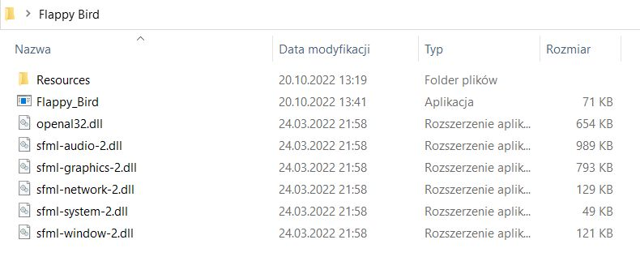

<h1>Flappy Bird :bird:</h1>

<h3>Description :page_facing_up:</h3>

Game created based on a tutorial from the [YouTube](https://www.youtube.com/watch?v=KNvRFEDQpOA&list=PLRtjMdoYXLf7DB3--POF9lYzaZu0poT5V&index=1) platform

<h2></h2>
<h3>Instruction :mag:</h3>

1) Download "Flappy_Bird.zip" (Releases / Zip)

2) Extract files

3) Fire up the .exe file
